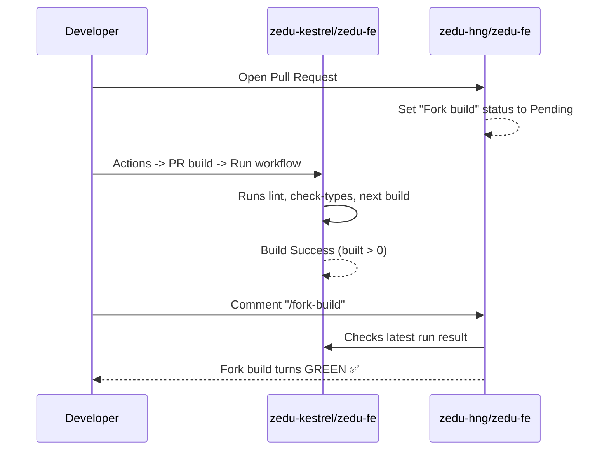

# 🤖 CI/CD & Automated Review Bots Blueprint

Zedu uses a rigorous suite of automated GitHub Actions, custom review scripts, and AI bots (CodeRabbit) to validate every Pull Request.

This blueprint explains every check, why it runs, the common traps that cause them to fail, and how to pass them effortlessly.

---

## 🚦 Summary of All CI/CD Checks

| Check Name | Tool / Workflow | Common Failure Cause | Fix |
| :--- | :--- | :--- | :--- |
| **`Structure, reuse, URLs, and secrets`** | PR Review Bot (`run.mjs`) | Hardcoded `http://` or `https://` URLs in code | Remove external URLs or use `mailto:` / env vars |
| **`Docstring Coverage`** | CodeRabbit AI | Missing JSDoc comments on exported functions/components | Add JSDoc `/** ... */` blocks |
| **`Fork build`** | `fork-build.yml` (Relay) | Build was skipped on fork because it was not triggered after PR creation | Go to fork Actions ➔ PR build ➔ Run workflow, then comment `/fork-build` on PR |
| **`Validate commit messages`** | `commitlint.yml` | Capital letters in commit/PR type, or missing colon | Use `feat(scope): description` in lowercase |
| **`Branch name`** | `pr-rules.yml` | Missing ticket number (e.g. `feature/contributor`) | Use `feat/<id>-<description>` |
| **`Protected files`** | `pr-rules.yml` | Editing files inside `.github/` or root config | Keep all changes inside your feature directory |
| **`Single author`** | `pr-rules.yml` | Commits from multiple email addresses in the same PR | Only push commits authored by one person per PR |

---

## 🔍 Deep Dive into Critical Checks

### 1. The Hardcoded URL Ban (`Structure, reuse, URLs, and secrets`)

**The Rule:**  
In `.github/pr-review.config.json`, the repository explicitly blocks hardcoded URLs:
```json
"hardcodedUrls": {
  "allowPatterns": [
    "^https?://(www\\.)?w3\\.org(/|$)",
    "^https?://avatars\\.githubusercontent\\.com/"
  ]
}
```
The review bot scans all added lines in `.ts`, `.tsx`, `.js`, and `.jsx` files using:
```javascript
const HARDCODED_URL_RE = /https?:\/\/[^\s"'`<>\\)]+/gi;
```
If ANY line includes `http://` or `https://` (such as `https://www.linkedin.com/...`), the review bot exits with code 1 and **blocks your PR from merging**.

**How to Comply:**
* For contact links: Use `mailto:${member.email}`.
* For internal links: Use relative paths (e.g. `/contributors/zedu-kestrel`).
* For external APIs: Always access via environment variables (e.g. `process.env.NEXT_PUBLIC_API_URL`).

---

### 2. CodeRabbit Docstring Coverage (Threshold: 80%+)

CodeRabbit scans every function and component touched in your pull request. If the docstring coverage is below 80%, it flags a warning.

**How to Comply:**
Always add standard JSDoc comments above your functions, if you added one:

```tsx
/**
 * Generates up to two uppercase initials from a full name.
 *
 * @param fullName - The full name of the contributor.
 * @returns A 1-2 character uppercase initials string.
 */
function getInitials(fullName: string): string { ... }

/**
 * ContributorCard renders an individual team member card with
 * avatar initials, background, role, and contact email.
 *
 * @param member - Contributor details object.
 * @returns The rendered contributor card component.
 */
export const ContributorCard = (member: Contributor) => { ... }
```

---

### 3. Avoiding CodeRabbit "AI Slop / Description Mismatch"

CodeRabbit compares your PR description with your actual `git diff`. If your description mentions things that do not exist in the code (for example, saying "added a dynamic counter" when there is no counter component in the diff), CodeRabbit flags the PR with:
> `⚠️ This pull request shows signs of AI-generated slop (description_diff_mismatch, ai_padded_prose).`

**How to Comply:**
* Keep your PR description concise and factual.
* Ensure every bullet point under `## What changed` corresponds to a file in the diff.
* Avoid generic AI filler words.

---

### 4. How the "Fork Build" Relay Works

The review repository (`zedu-hng/zedu-fe`) does not build fork code directly with its own CI tokens. Instead, it inspects your fork's `PR build` workflow via the GitHub API and relays the result.



**Why it says "No open PR... skipping build":**
The fork's `pr-build.yml` checks:
```bash
gh api -X GET "repos/$REVIEW_REPO/pulls" -f state=open -f head="$OWNER:$BRANCH"
```
It skips building if there is no **OPEN** PR into `zedu-hng/zedu-fe`.
Therefore:
1. **Always open the PR first.**
2. Then go to your fork: **Actions ➔ PR build ➔ Run workflow** on your branch.
3. Wait 2 minutes for it to complete.
4. Comment `/fork-build` on your PR.
