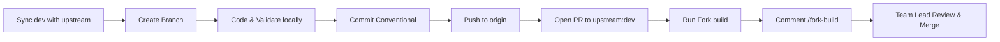

# 🛠️ Contribution & Git Workflow Guide

This document outlines the mandatory development and Pull Request workflow for Team Kestrel. Adhering strictly to these guidelines ensures your PR passes every automated check without delays.

---

## 🔄 The Golden Development Lifecycle



---

## 1. Syncing Before Starting Any Task

**Always start from a fresh, up-to-date `dev` branch!**

```bash
# 1. Switch to local dev
git checkout dev

# 2. Pull the latest merged changes from HNG upstream
git pull upstream dev

# 3. Keep your fork's dev updated
git push origin dev
```

---

## 2. Branch Naming Rules (Strict CI Enforced)

The review repository enforces the following regex pattern via GitHub Actions:
```regex
^(feat|fix|test|docs|refactor|chore|perf|security)/([A-Za-z]+-)?[0-9]+-[a-z0-9-]+$
```

### Pattern Anatomy:
`<type>/<ticket-or-task-number>-<short-description-in-kebab-case>`

| Allowed Types | Example Ticket Prefix | Example Valid Branch Names |
| :--- | :--- | :--- |
| `feat/` | `task-2-` or `2-` | `feat/task-2-zedu-kestrel-contributors-page` |
| `fix/` | `chat-142-` | `fix/chat-142-input-overflow` |
| `refactor/` | `stage-2-` | `refactor/stage-2-avatar-component` |
| `chore/` | `10-` | `chore/10-update-team-metadata` |

### ❌ What Will FAIL CI:
* `feature/contributor` *(uses `feature/` instead of `feat/`, missing ticket number)*
* `feat/contributors-page` *(missing numeric ticket/task ID)*
* `feat/TASK-2-Contributors` *(contains uppercase letters)*
* `dev` or `staging` *(never work directly on main branches)*

### Create Your Branch:
```bash
git checkout -b feat/task-2-your-feature-name
```

---

## 3. Commit Message Convention

Commits are validated by **`commitlint`**. Every commit message must follow the Conventional Commits format:

```text
<type>(<scope>): <short description in lowercase>
```

### Valid Commit Examples:
* `feat(homepage): add team kestrel contributors page`
* `fix(contributors): remove external link from card`
* `docs(readme): add setup and contribution guide`
* `refactor(avatar): extract initials generator helper`

> [!WARNING]
> Never use capitalized types or omit the colon (`:`).
> * ❌ `Feat/task 2 zedu kestrel contributors page` *(FAIL: capital `F`, no colon)*
> * ❌ `fix contributor card` *(FAIL: missing colon and type separator)*

---

## 4. Pull Request (PR) Requirements

### 4.1. TARGETING RULE (Critical!)
When opening a PR on GitHub:
* **Base repository:** `zedu-hng/zedu-fe`
* **Base branch:** `dev`
* **Head repository:** `zedu-kestrel/zedu-fe`
* **Compare branch:** `feat/your-ticket-branch-name`

> [!CAUTION]
> **NEVER target `zeduchat/zedu-fe`** (the old root repository).  
> **NEVER target `zedu-kestrel/zedu-fe:dev`** (opening PRs into your own fork's dev combines author commits and violates the Single Author rule).

### 4.2. PR Title Convention
Your PR title is also validated by `commitlint`. Match the same conventional commit format:
```text
feat(homepage): add team kestrel contributors page
```

### 4.3. PR Body Template
Copy and fill out this exact Markdown template in your PR description:

```markdown
## Ticket

- **Ticket ID:** task-2
- **Ticket title:** Add Team Kestrel Contributors Page

## Team lead

@yvnks

## What changed

- Added Team Kestrel contributors page at `/contributors/zedu-kestrel`.
- Added contributor data list for the 20 team members in `_lib/contributors.ts`.
- Added `ContributorCard` component displaying avatar initials, background, role, and contact links.
- Added page layout with metadata, hero section, and responsive grid.

## Why

To showcase the Team Kestrel members contributing to Zedu during the HNG 15 Internship.

## How to test

1. Run `pnpm dev`.
2. Visit `http://localhost:3000/contributors/zedu-kestrel`.
3. Verify all contributor cards render accurately.
4. Run `pnpm check-types` and `pnpm check-lint`.

## What to expect

The contributors page loads with the hero banner and member cards without errors or broken links.

## Test evidence

- Tested against: Local dev server (`http://localhost:3000`)
- Tests: Verified locally with `pnpm check-format`, `pnpm check-lint`, and `pnpm check-types`.

## Mandatory checks

- [x] **Atomic:** exactly one ticket, max ~1 day of work (≤400 lines). Larger needs a `size-override` label from a reviewer.
- [x] **Feature flag:** new routes and large features sit behind a `NEXT_PUBLIC_FF_*` flag, default `OFF`.
  - Flag name: `N/A`
- [x] **Database / API contract:** schema changes follow Expand-Contract — no destructive drops or renames.
- [x] **Preview:** I verified the change in the fork build (and my team's preview link, if we deploy one).
- [x] **Protected files:** I did not change `.github/`, `AGENTS.md`, `CONTRIBUTING.md` or tooling config without reviewer agreement and the `config-change-approved` label.

## AI usage

Used AI pair programming to structure the page components and verify type safety.

## Checklist

- [x] Linked to an approved ticket
- [x] Only intended files changed
- [x] No secrets or debug code committed
- [x] Tests added/updated for what this ticket changed
- [x] Fork build triggered
- [ ] Team lead approved this PR
- [x] Self-reviewed (`git status` / `git diff`)
```

---

## 5. Post-Merge Branch Deletion

Once your PR has been merged into `zedu-hng/zedu-fe:dev`:

```bash
# 1. Switch back to dev
git checkout dev

# 2. Pull the latest merge
git pull upstream dev
git push origin dev

# 3. Safely delete your feature branch locally
git branch -d feat/your-ticket-branch-name

# 4. Delete the remote branch on your fork
git push origin --delete feat/your-ticket-branch-name
```
