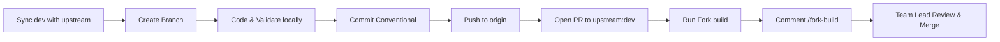

# 🛠️ Contribution & Git Workflow Guide

This document outlines the mandatory development and Pull Request workflow for Team Kestrel. Adhering strictly to these guidelines ensures your PR passes every automated check without delays.

---

## 🔄 The Golden Development Lifecycle



---

## 1. Syncing Before Starting Any Task

**Always start from a fresh, up-to-date `dev` branch!**

```bash
# 1. Switch to local dev
git checkout dev

# 2. Pull the latest merged changes from HNG upstream
git pull upstream dev

# 3. Keep your fork's dev updated
git push origin dev
```

---

## 2. Branch Naming Rules (Strict CI Enforced)

The review repository enforces the following regex pattern via GitHub Actions:
```regex
^(feat|fix|test|docs|refactor|chore|perf|security)/([A-Za-z]+-)?[0-9]+-[a-z0-9-]+$
```

### Pattern Anatomy:
`<type>/<ticket-or-task-number>-<short-description-in-kebab-case>`

| Allowed Types | Example Ticket Prefix | Example Valid Branch Names |
| :--- | :--- | :--- |
| `feat/` | `task-2-` or `2-` | `feat/task-2-zedu-kestrel-contributors-page` |
| `fix/` | `chat-142-` | `fix/chat-142-input-overflow` |
| `refactor/` | `stage-2-` | `refactor/stage-2-avatar-component` |
| `chore/` | `10-` | `chore/10-update-team-metadata` |

### ❌ What Will FAIL CI:
* `feature/contributor` *(uses `feature/` instead of `feat/`, missing ticket number)*
* `feat/contributors-page` *(missing numeric ticket/task ID)*
* `feat/TASK-2-Contributors` *(contains uppercase letters)*
* `dev` or `staging` *(never work directly on main branches)*

### Create Your Branch:
```bash
git checkout -b feat/task-2-your-feature-name
```

---

## 3. Commit Message Convention

Commits are validated by **`commitlint`**. Every commit message must follow the Conventional Commits format:

```text
<type>(<scope>): <short description in lowercase>
```

### Valid Commit Examples:
* `feat(KESTREL-001): add team kestrel contributors page`
* `chore(KESTREL-004): update contributor display name text`
* `fix(KESTREL-012): remove external link from card`
* `docs(KESTREL-003): update setup and contribution guide`

> [!WARNING]
> Never use capitalized types or omit the colon (`:`).
> * ❌ `Feat/task 2 zedu kestrel contributors page` *(FAIL: capital `F`, no colon)*
> * ❌ `fix contributor card` *(FAIL: missing colon and type separator)*

---

## 4. Syncing & Pushing Your Branch

Right before pushing to GitHub, always rebase with upstream in one line to ensure your branch has zero merge conflicts:

```bash
git pull --rebase upstream dev
```

Then push your branch to Team Kestrel's fork:

```bash
# If pushing for the first time:
git push -u origin feat/your-ticket-branch-name

# If updating a branch you ALREADY pushed earlier (after a rebase):
git push --force-with-lease origin feat/your-ticket-branch-name
```

> [!TIP]
> **What does `--force-with-lease` mean?**  
> When you rebase, Git creates new commit hashes. `--force-with-lease` is the **safe version of force-push**. It updates GitHub with your rebased commit, but automatically cancels if anyone else pushed commits to that branch in the meantime. Never use plain `git push --force`.

---

## 5. Pull Request (PR) Requirements

### 5.1. TARGETING RULE (Critical!)
When opening a PR on GitHub:
* **Base repository:** `zedu-hng/zedu-fe`
* **Base branch:** `dev`
* **Head repository:** `zedu-kestrel/zedu-fe`
* **Compare branch:** `feat/your-ticket-branch-name`

> [!CAUTION]
> **NEVER target `zeduchat/zedu-fe`** (the old root repository).  
> **NEVER target `zedu-kestrel/zedu-fe:dev`** (opening PRs into your own fork's dev combines author commits and violates the Single Author rule).

### 5.2. PR Title Convention (Ticket ID Required in Scope!)
Your PR title is validated by `commitlint`. You **MUST** include your ticket number (e.g. `KESTREL-001`) inside the parentheses:

```text
<type>(<TICKET-ID>): <short description in lowercase>
```

#### Valid PR Title Examples:
* `feat(KESTREL-001): add team kestrel contributors page`
* `chore(KESTREL-004): update contributor display name text`
* `fix(KESTREL-012): resolve overflow on mobile navigation`
* `refactor(KESTREL-008): extract reusable card component`

### 5.3. PR Body Template
Copy and fill out this exact Markdown template in your PR description (matches upstream's `.github/pull_request_template.md`):

```markdown
## Ticket

<!-- Link the approved ClickUp/Linear ticket. -->

- **Ticket ID:** KESTREL-001
- **Ticket title:** Add Team Kestrel Contributors Page

## Team lead

<!-- @handle of your team lead. They review and approve before Zedu reviewers pick this up. -->

@yvnks

## What changed

<!-- Short summary of the change. -->

- Added Team Kestrel contributors page at `/contributors/zedu-kestrel`.
- Added contributor data list in `_lib/contributors.ts`.
- Added `ContributorCard` component displaying avatar, role, and bio.

## Why

<!-- The problem or reason this ticket exists. -->

To showcase Team Kestrel members contributing to Zedu during the HNG 15 Internship.

## How to test

<!-- Numbered steps a reviewer can follow to verify the change themselves. -->

1. Run `pnpm dev`.
2. Visit `http://localhost:3000/contributors/zedu-kestrel`.
3. Verify contributor cards render properly.
4. Run `pnpm check-types` and `pnpm check-lint`.

## What to expect

<!-- The expected behaviour after following the steps above. -->

The contributors page loads smoothly with member cards and zero console errors.

## Backend

<!-- Leave this section empty: your preview runs against the dev backend.
     Only if this PR needs backend work that isn't on dev yet, add a line here starting with "Backend URL:"
     followed by that backend's host, for example https://api.<team>.groups.zedu.chat. The Backend dependency
     check then blocks merging until the backend lands on dev and you delete the line. -->

## Test evidence

<!-- The Fork build check reports the build result automatically. Say which backend you tested against,
     and whether tests were added or updated for what this ticket changed (and why not, if not). -->

- Tested against: Local dev server (`http://localhost:3000`) / dev backend
- Tests: Verified locally with `pnpm check-format`, `pnpm check-lint`, `pnpm check-types`, and `pnpm build`.

## Mandatory checks

- [x] **Atomic:** one logical change, at most ~400 lines of meaningful code (lockfiles and generated files like `*.tsbuildinfo` don't count). Larger needs a `size-override` label from a reviewer.
- [x] **Database / API contract:** schema changes follow Expand-Contract — no destructive drops or renames.
- [x] **Preview:** I checked the change in my fork's preview (or the fork build, if the team hasn't set up previews).
- [x] **Protected files:** I did not change `.github/`, `AGENTS.md`, `CONTRIBUTING.md` or tooling config without reviewer agreement and the `config-change-approved` label.

## Screenshots / recording

<!-- Required for visible or interactive changes. Otherwise write "N/A, non-visual change". -->

N/A, non-visual or include screenshot of rendered page here.

## AI usage

<!-- One line on how AI was used, if significant (see CONTRIBUTING.md, "AI usage"). -->

Assisted by AI to scaffold components and verify TypeScript types.

## Checklist

- [x] Linked to an approved ticket
- [x] Only intended files changed
- [x] No secrets or debug code committed
- [x] Tests added/updated for what this ticket changed (not retroactive coverage of unrelated code)
- [x] Fork build triggered (first run: fork → Actions → PR build → Run workflow)
- [ ] Team lead approved this PR
- [x] Self-reviewed (`git status` / `git diff`)
```

---

## 6. Updating an Out-of-Date Pull Request (`--force-with-lease`)

When your PR is open on GitHub and someone else's PR gets merged into `dev`, GitHub may display:
> *"This branch is out of date with the base branch."*

### ⚠️ Warning: Do NOT click GitHub's "Update branch" button!
Clicking that button creates an automated `Merge branch 'dev' into...` commit. That merge commit often **fails the commitlint check** and violates HNG's **single-author rule**.

### ✅ The Safe Way: Rebase & Force-Push Locally
While on your feature branch (e.g. `feat/your-ticket-branch-name`), run these 3 commands in your terminal:

```bash
# 1. Fetch the latest changes from upstream
git fetch upstream

# 2. Rebase your commit cleanly on top of upstream dev
git rebase upstream/dev

# 3. Safely update your open PR on GitHub
git push --force-with-lease origin feat/your-ticket-branch-name
```

### What does `--force-with-lease` mean?
* When you rebase, Git creates new commit hashes. Because the history changed, a normal `git push` is rejected.
* `--force-with-lease` is the **safe version of force-push**. It updates GitHub with your rebased commit, but **aborts immediately** if someone else pushed changes to that branch that you haven't seen.
* Unlike dangerous `git push --force` (which blindly wipes out work), `--force-with-lease` safely updates your PR with zero risk of overwriting other people's commits.

---

## 7. Post-Merge Branch Deletion

Once your PR has been merged into `zedu-hng/zedu-fe:dev`:

```bash
# 1. Switch back to dev
git checkout dev

# 2. Pull the latest merge
git pull upstream dev
git push origin dev

# 3. Safely delete your feature branch locally
git branch -d feat/your-ticket-branch-name

# 4. Delete the remote branch on your fork
git push origin --delete feat/your-ticket-branch-name
```
