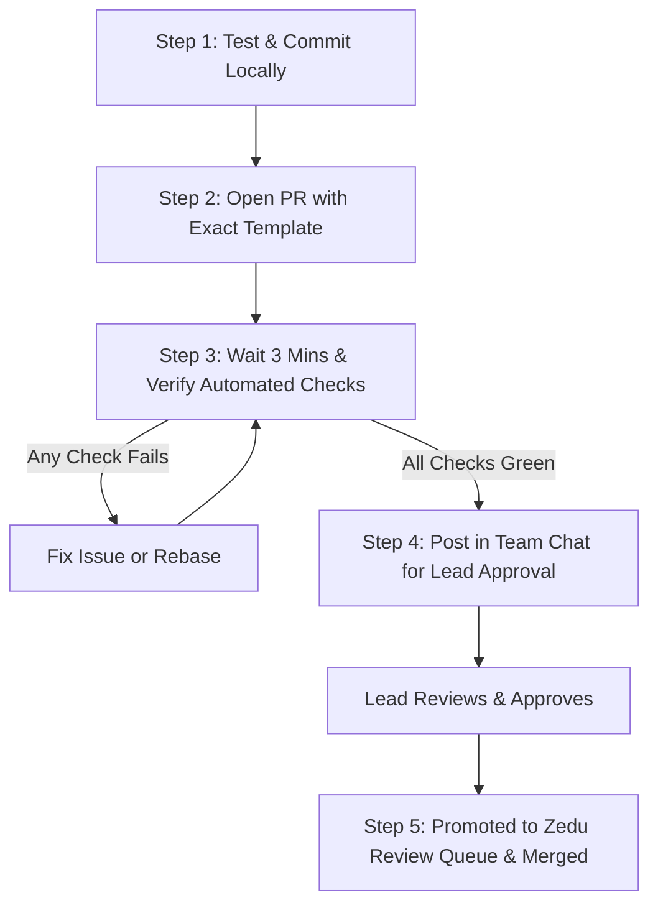

# 🚀 Team Kestrel PR Workflow & Troubleshooting Guide

This guide outlines the standard operating procedure for opening, managing, and merging Pull Requests into `zedu-hng/zedu-fe`. Follow this exact workflow to ensure your PR passes all automated checks and gets merged quickly without delays.

## 📑 Table of Contents

- [🧭 The 5-Step PR Lifecycle](#-the-5-step-pr-lifecycle)
  - [Step 1: Pre-Flight Verification](#step-1-pre-flight-verification-before-pushing)
  - [Step 2: Open PR with Exact Template](#step-2-open-the-pull-request-on-github)
  - [Step 3: The 3-Minute Wait Period & Check Statuses](#step-3-the-wait-period--automated-check-verification)
  - [Step 4: Drop PR in Team Chat](#step-4-drop-your-pr-in-the-team-chat)
  - [Step 5: Lead Approval](#step-5-team-lead-approval)
- [🎯 How to Confirm Your PR is Ready & Queued for Merge](#-how-to-confirm-your-pr-is-ready--queued-for-merge)
- [🔄 How to Update an Out-of-Date Branch](#-how-to-update-an-out-of-date-branch)
  - [Why Not Use GitHub's Web Rebase Button?](#-why-not-just-click-githubs-web-rebase-button)
- [🛠️ Common PR Check Failures & Fixes](#️-common-pr-check-failures--instant-fixes)
  - [1. PR Template Unticked Error](#1-pr-template-failure-tick-every-checkbox-in-the-pr-template)
  - [2. PR Title or Branch Name Failure](#2-pr-title-or-branch-name-failure)
  - [3. Fork Build Pending or Failure](#3-fork-build-pending-or-failure)
  - [4. Lead Approved Failure](#4-lead-approved-showing-as-failing--red-)
  - [5. Hardcoded URL Ban](#5-structure-reuse-urls-and-secrets-failure)

---

## 🧭 The 5-Step PR Lifecycle



---

### Step 1: Pre-Flight Verification (Before Pushing)
Before pushing your branch, run all local quality checks in your terminal:

```powershell
pnpm run check-format
pnpm run check-lint
pnpm run check-types
pnpm run build
```
Ensure you have zero errors. Verify that:
* **Branch name** follows: `feat/KESTREL-xxx-description` or `chore/KESTREL-xxx-description`.
* **Commit message** follows: `feat(KESTREL-xxx): description` or `chore(KESTREL-xxx): description` (lowercase type, ticket ID in parenthesis).

---

### Step 2: Open the Pull Request on GitHub
Go to **[zedu-hng/zedu-fe/pulls](https://github.com/zedu-hng/zedu-fe/pulls)** and click **New pull request**:
* **Base repository:** `zedu-hng/zedu-fe` (branch: `dev`)
* **Head repository:** `zedu-kestrel/zedu-fe` (branch: `your-branch-name`)
* **PR Title:** Must match your commit and branch ticket ID (e.g. `chore(KESTREL-004): update contributor bio to ai engineer`).
* **PR Description:** You **MUST** use the exact PR template with **every single checkbox ticked with `[x]` verbatim**.

> ⚠️ **THE 3-WAY TICKET MATCH RULE (CRITICAL):**  
> The ticket number in your **Branch Name**, your **PR Title**, and your **PR Description Body** (`- **Ticket ID:** ...`) **MUST ALL BE IDENTICAL!**  
> * Example: If your branch is `feat/KESTREL-022-...`, your PR title **MUST** be `feat(KESTREL-022): ...`, and your PR body **MUST** say `- **Ticket ID:** KESTREL-022`.  
> * If you copy the PR template and leave an example like `KESTREL-001` or `KESTREL-004`, the automated CI check will immediately fail with a ticket mismatch error!

---

### Step 3: The "Wait" Period & Automated Check Verification
> ⚠️ **DO NOT open a PR and immediately leave or post in the team chat!**

1. Wait **2 to 3 minutes** for the GitHub Actions suite to finish.
2. Scroll to the bottom of your PR page and inspect the checks box.
3. Check the status of your checks at the bottom of the PR:
   * **`Passed`, `OK`, or `Skipped` are all completely fine!** (For example, `Fork build` is skipped when disabled in the fork, and some lint/preview steps are skipped on non-code changes — that is totally valid).
   * **The key rule:** You must have **NO red ❌ failures** on code, linting, types, build, branch name, or PR template.
   * *(Note: `Lead approved` is the ONLY check that will show as a red ❌ or "failing" before review, with the message: `Waiting for an approving review from a team lead: @Fabito97 @yvnks`. That is completely normal).*

---

### Step 4: Drop Your PR in the Team Chat
Once all code checks are green (and only `Lead approved` is waiting), drop your PR link in the chat and tag your team lead:

```text
@Fabito97 Please review: <LINK_TO_YOUR_PR>
```

> ⚠️ **IMPORTANT RULE:**  
> Dropping your PR link in the team chat **certifies that you have personally waited and verified that all automated CI checks are GREEN**. Do not drop broken PRs into the chat!

---

### Step 5: Team Lead Approval
1. Either **`@Fabito97`** or **`@yvnks`** will inspect your PR on GitHub, go to the **Files changed** tab, and click **Approve**.
2. Once approved, the `Lead approved` check turns green.
3. Upstream will automatically attach the `ready-for-review` label and promote your PR into the **Central Zedu Reviewer Queue**.

---

## 🎯 How to Confirm Your PR is Ready & Queued for Merge

After receiving team lead approval, you can verify if your PR is officially queued for merge by visiting this link:

👉 **[Zedu Ready-for-Review Queue](https://github.com/zedu-hng/zedu-fe/pulls?q=is%3Apr+state%3Aopen+label%3Aready-for-review+status%3Asuccess)**

### What finding your PR here means:
* ✅ **All automated checks are green or properly skipped.**
* ✅ **Team Lead approval is complete.**
* ✅ **The `ready-for-review` label is attached.**
* 🎉 **You are 100% good to go!** A Zedu core reviewer (`@zedu-hng/reviewers`) will claim your PR with `/claim` and merge it into `dev`. You do not need to do anything further!

---

## 🔄 How to Update an Out-of-Date Branch

When other PRs merge into `dev`, GitHub will show a yellow box:
> *"This branch is out-of-date with the base branch."*

### ⚠️ NEVER click GitHub's default "Update branch" button!
Clicking the default button creates an automated `Merge branch 'dev' into...` commit. That merge commit **fails the `commitlint` check**, violates the **single-author rule**, and pollutes the Git history.

### ❓ Why Not Just Click GitHub's Web "Rebase" Button?
GitHub does have a dropdown option to "Update with rebase", but relying on the web button has **critical risks**:
1. **Your Local Machine Becomes Outdated:** When you click rebase on GitHub, GitHub rebuilds the commit on the remote server. Your local computer still has the old commits! The next time you test, make changes, or try to push, Git will fail with merge divergence errors.
2. **Web Button Fails on Any Conflict:** If another teammate edited nearby lines, GitHub's web interface cannot resolve the rebase and completely disables the button.
3. **Cross-Fork Permission Restrictions:** On fork pull requests, GitHub often blocks web rebasing unless specific cross-repo write permissions are granted.

### ✅ The Clean Way: Rebase from Your Terminal
Running it locally in your terminal takes 5 seconds, avoids all web bugs, and keeps your local code and GitHub 100% in sync:

```powershell
# 1. Fetch latest upstream dev and replay your commit cleanly on top:
git pull --rebase upstream dev

# 2. Safely push your rebased branch to your fork:
git push --force-with-lease origin HEAD
```

**Why this works:**
* `git pull --rebase` keeps your branch at exactly 1 clean commit on top of the newest code.
* `HEAD` targets your current checked-out branch automatically.
* `--force-with-lease` safely updates your PR without any risk of overwriting remote work.

---

## 🛠️ Common PR Check Failures & Instant Fixes

### 1. `PR template` Failure (`Tick every checkbox in the PR template`)
* **How It Works:** Upstream's CI downloads the live `.github/pull_request_template.md` directly from `zedu-hng/zedu-fe:dev` and compares each checkbox line **character-for-character**. If any line is shortened, modified, or left unticked (`[ ]`), the check immediately fails.
* **Where to Always Get the Latest Official Template:**  
  If upstream ever updates the template or adds new checklist items, always grab the single source of truth directly from upstream:  
  👉 **[Official Upstream PR Template (Live on `dev`)](https://github.com/zedu-hng/zedu-fe/blob/dev/.github/pull_request_template.md)**  
  *(Or check your local repo file: `.github/pull_request_template.md`)*
* **How to Fix It on Your PR:**
  1. Open the failed **PR rules** check on your PR — the error log explicitly lists the exact lines considered `Unticked`.
  2. Copy the exact `## Mandatory checks` and `## Checklist` blocks from the official template (or from below).
  3. Ensure **every single checkbox** has `- [x]` verbatim (do not delete or edit any text!).
  4. Click **Edit** on your PR description, paste the exact lines, and click **Update comment**.
  5. The `PR template` check will automatically re-run and turn **green in ~5 seconds** without pushing code!

```markdown
## Mandatory checks

- [x] **Atomic:** one logical change, at most ~400 lines of meaningful code (lockfiles and generated files like `*.tsbuildinfo` don't count). Larger needs a `size-override` label from a reviewer.
- [x] **Database / API contract:** schema changes follow Expand-Contract — no destructive drops or renames.
- [x] **Preview:** I checked the change in my fork's preview (or the fork build, if the team hasn't set up previews).
- [x] **Protected files:** I did not change `.github/`, `AGENTS.md`, `CONTRIBUTING.md` or tooling config without reviewer agreement and the `config-change-approved` label.

## Checklist

- [x] Linked to an approved ticket
- [x] Only intended files changed
- [x] No secrets or debug code committed
- [x] Tests added/updated for what this ticket changed (not retroactive coverage of unrelated code)
- [x] Fork build triggered (first run: fork → Actions → PR build → Run workflow)
- [x] Team lead approved this PR
- [x] Self-reviewed (`git status` / `git diff`)
```

---

### 2. `PR title` or `Branch name` Failure
* **Cause 1: Ticket Number Mismatch**  
  Upstream's CI extracts the digits from your branch name and your PR title and compares them. If your branch is `feat/KESTREL-022-...` but your PR title says `feat(KESTREL-001): ...` (e.g. copied from a guide example), CI will fail with:
  > `Error: PR title ticket '001' doesn't match the branch ticket '022'. Use the same ticket as your branch name.`
* **Cause 2: Invalid Conventional Commit Format**  
  Missing ticket in parenthesis, uppercase type, or missing colon (e.g. `feat: my title` or `Feat(KESTREL-022): my title` instead of `feat(KESTREL-022): my title`).
* **Fix:**
  * **If your branch name is correct:** Simply click **Edit** next to your PR title on GitHub, update the ticket ID to match your branch, and click **Save**. The `PR title` check will automatically re-run and turn green immediately without pushing new code!
  * **Check your PR description too:** Ensure `- **Ticket ID:** KESTREL-xxx` inside your description also matches your branch number.
  * **If the branch name itself is wrong:** Rename your branch locally (`git branch -m <correct-name>`), push it (`git push -u origin <correct-name>`), and open a new PR.

---

### 3. `Fork build` Pending or Failure
* **Cause:** When you first push a branch, your fork might not have run the build job, or the relay timed out.
* **Fix:**
  1. Open your fork: `https://github.com/zedu-kestrel/zedu-fe/actions/workflows/pr-build.yml`.
  2. Click **Run workflow**, choose your branch, and run it.
  3. Go back to your PR on `zedu-hng/zedu-fe` and post a comment:
     ```text
     /fork-build
     ```
  4. The upstream bot will re-evaluate your fork's run and update the status to passed.

---

### 4. `Lead approved` Showing as "Failing" / Red ❌
* **Cause:** By default, GitHub marks `Lead approved` with a red ❌ and the description: *"Waiting for an approving review from a team lead: @Fabito97 @yvnks"*. **This does NOT mean your code failed!** It simply indicates that the PR is waiting for lead review, and GitHub strictly prevents authors from self-approving.
* **Fix:** When all your other checks are green and you see this, simply drop your PR link in the chat and tag `@Fabito97`. Once we submit an approving review, the red ❌ instantly turns into a green ✅!

---

### 5. `Structure, reuse, URLs, and secrets` Failure
* **Cause:** You included a hardcoded `http://` or `https://` link (e.g. LinkedIn, personal portfolio) in frontend code.
* **Fix:** Remove the external URL. Use `mailto:${email}` for contacts, relative paths (`/contributors/...`) for navigation, or environment variables for API endpoints.
