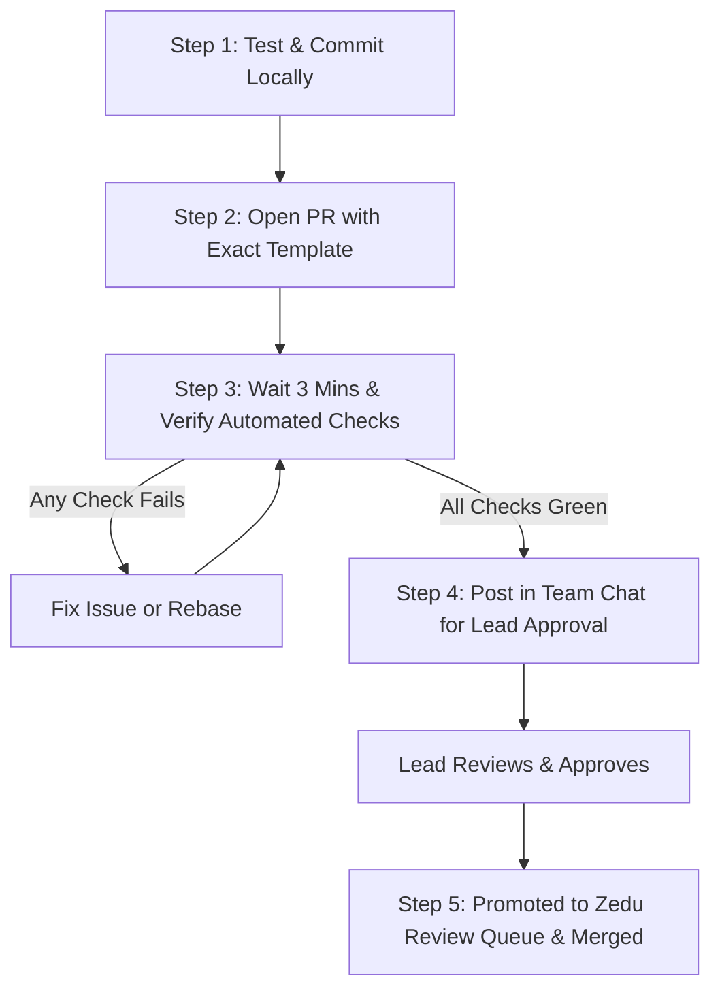

# 🚀 Team Kestrel PR Workflow & Troubleshooting Guide

This guide outlines the standard operating procedure for opening, managing, and merging Pull Requests into `zedu-hng/zedu-fe`. Follow this exact workflow to ensure your PR passes all automated checks and gets merged quickly without delays.

---

## 🧭 The 5-Step PR Lifecycle



---

### Step 1: Pre-Flight Verification (Before Pushing)
Before pushing your branch, run all local quality checks in your terminal:

```powershell
pnpm run check-format
pnpm run check-lint
pnpm run check-types
pnpm run build
```
Ensure you have zero errors. Verify that:
* **Branch name** follows: `feat/KESTREL-xxx-description` or `chore/KESTREL-xxx-description`.
* **Commit message** follows: `feat(KESTREL-xxx): description` or `chore(KESTREL-xxx): description` (lowercase type, ticket ID in parenthesis).

---

### Step 2: Open the Pull Request on GitHub
Go to **[zedu-hng/zedu-fe/pulls](https://github.com/zedu-hng/zedu-fe/pulls)** and click **New pull request**:
* **Base repository:** `zedu-hng/zedu-fe` (branch: `dev`)
* **Head repository:** `zedu-kestrel/zedu-fe` (branch: `your-branch-name`)
* **PR Title:** Must match your commit and branch ticket ID (e.g. `chore(KESTREL-004): update contributor bio to ai engineer`).
* **PR Description:** You **MUST** use the exact PR template with **every single checkbox ticked with `[x]` verbatim**.

---

### Step 3: The "Wait" Period & Automated Check Verification
> ⚠️ **DO NOT open a PR and immediately leave or post in the team chat!**

1. Wait **2 to 3 minutes** for the GitHub Actions suite to finish.
2. Scroll to the bottom of your PR page and inspect the checks box.
3. Every automated check must have a green checkmark (`Passed` / `OK`):
   * `Branch name` ✅
   * `PR title` ✅
   * `PR template` ✅
   * `Prettier, ESLint, TypeScript & Build` ✅
   * `Security scans (Semgrep, Gitleaks, ClamAV)` ✅
   * `Preview status` ✅
   * `Fork build` ✅

*(The only check that should be pending at this point is `Lead approved`, which waits for a team lead review).*

---

### Step 4: Drop Your PR in the Team Group Chat
Once your PR has all green checks (with only `Lead approved` waiting), post your PR in the **Team Kestrel group chat** using this format:

```text
👋 Hi Team Leads (@Fabito97 / @yvnks),
My PR is ready for review! All automated CI checks are passed.

🔗 PR: https://github.com/zedu-hng/zedu-fe/pull/<PR-NUMBER>
🏷️ Ticket: KESTREL-xxx
📝 Summary: <Short description of what was changed>
```

---

### Step 5: Team Lead Approval & Core Review Queue
1. Either **`@Fabito97`** or **`@yvnks`** will inspect your PR on GitHub, go to the **Files changed** tab, and click **Approve**.
2. Once approved, the `Lead approved` check turns green.
3. Upstream will automatically attach the `ready-for-review` label and add your PR to the **Central Zedu Reviewer Queue**.
4. **How to verify your PR is ready to merge:**  
   Visit the official queue link below:  
   👉 **[Zedu Ready-for-Review Queue](https://github.com/zedu-hng/zedu-fe/pulls?q=is%3Apr+state%3Aopen+label%3Aready-for-review+status%3Asuccess)**  
   If your PR appears in this list, **you are 100% good to go!** A core reviewer (`@zedu-hng/reviewers`) will claim it with `/claim` and merge it into `dev`! 🎉

---

## 🔄 How to Update an Out-of-Date Branch

When other PRs merge into `dev`, GitHub will show a yellow box:
> *"This branch is out-of-date with the base branch."*

### ⚠️ NEVER click GitHub's "Update branch" button!
Clicking that button creates an automated `Merge branch 'dev' into...` commit. That merge commit **fails the `commitlint` check**, violates the **single-author rule**, and pollutes the Git history.

### ✅ The Clean Way: Rebase from Your Terminal
Run these two commands while on your feature branch:

```powershell
# 1. Fetch latest upstream dev and replay your commit cleanly on top:
git pull --rebase upstream dev

# 2. Safely push your rebased branch to your fork:
git push --force-with-lease origin HEAD
```

**Why this works:**
* `git pull --rebase` keeps your branch at exactly 1 clean commit on top of the newest code.
* `HEAD` targets your current checked-out branch automatically.
* `--force-with-lease` safely updates your PR without any risk of overwriting remote work.

---

## 🛠️ Common PR Check Failures & Instant Fixes

### 1. `PR template` Failure (`Tick every checkbox in the PR template`)
* **Cause:** The CI validator compares each checkbox line against upstream's template character-for-character. If you shortened, truncated, or left any box unticked (including `Team lead approved this PR`), the check fails.
* **Fix:** Copy the exact mandatory checks and checklist blocks below into your PR description and click **Update comment**:

```markdown
## Mandatory checks

- [x] **Atomic:** one logical change, at most ~400 lines of meaningful code (lockfiles and generated files like `*.tsbuildinfo` don't count). Larger needs a `size-override` label from a reviewer.
- [x] **Database / API contract:** schema changes follow Expand-Contract — no destructive drops or renames.
- [x] **Preview:** I checked the change in my fork's preview (or the fork build, if the team hasn't set up previews).
- [x] **Protected files:** I did not change `.github/`, `AGENTS.md`, `CONTRIBUTING.md` or tooling config without reviewer agreement and the `config-change-approved` label.

## Checklist

- [x] Linked to an approved ticket
- [x] Only intended files changed
- [x] No secrets or debug code committed
- [x] Tests added/updated for what this ticket changed (not retroactive coverage of unrelated code)
- [x] Fork build triggered (first run: fork → Actions → PR build → Run workflow)
- [x] Team lead approved this PR
- [x] Self-reviewed (`git status` / `git diff`)
```
*(As soon as you save the edit, `pr-rules` will re-run automatically and turn green without pushing new code!)*

---

### 2. `PR title` or `Branch name` Failure
* **Cause:** The ticket ID in your branch name does not match the ticket ID in your PR title, or conventional commit format is missing (e.g. `feat: my title` instead of `feat(KESTREL-001): my title`).
* **Fix:**
  * If the branch name is correct: Simply edit the PR title on GitHub. `pr-rules` will re-run and pass immediately.
  * If the branch name is wrong: Rename your branch locally (`git branch -m <correct-name>`), push it (`git push -u origin <correct-name>`), and open a new PR.

---

### 3. `Fork build` Pending or Failure
* **Cause:** When you first push a branch, your fork might not have run the build job, or the relay timed out.
* **Fix:**
  1. Open your fork: `https://github.com/zedu-kestrel/zedu-fe/actions/workflows/pr-build.yml`.
  2. Click **Run workflow**, choose your branch, and run it.
  3. Go back to your PR on `zedu-hng/zedu-fe` and post a comment:
     ```text
     /fork-build
     ```
  4. The upstream bot will re-evaluate your fork's run and update the status to passed.

---

### 4. `Lead approved` Failure
* **Cause:** PR authors **cannot approve their own PRs**. GitHub strictly forbids self-approving reviews.
* **Fix:** Drop your PR link in the team chat and ask **`@Fabito97`** or **`@yvnks`** to review and submit an approval via GitHub's **Files changed** ➔ **Review changes** tab.

---

### 5. `Structure, reuse, URLs, and secrets` Failure
* **Cause:** You included a hardcoded `http://` or `https://` link (e.g. LinkedIn, personal portfolio) in frontend code.
* **Fix:** Remove the external URL. Use `mailto:${email}` for contacts, relative paths (`/contributors/...`) for navigation, or environment variables for API endpoints.
